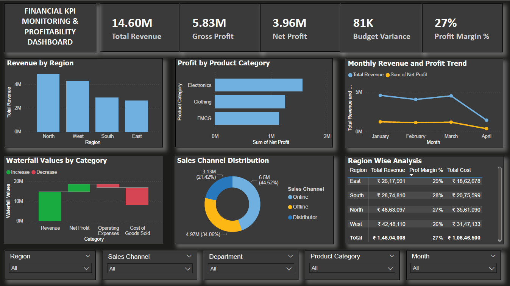

# financial-kpi-dashboard-powerbi
Power BI dashboard for financial KPI monitoring, profitability analysis, and business performance tracking
Financial KPI Monitoring & Profitability Dashboard

📊 Overview
This project is a Power BI dashboard designed to track financial performance, profitability, and business KPIs.

🎯 Objectives
- Monitor revenue, cost, and profit
- Analyze budget vs actual performance
- Identify top-performing regions and products

🛠 Tools Used
- Power BI
- Excel
- DAX
- Power Query

📈 Key Features
- KPI Cards (Revenue, Profit, Margin)
- Waterfall Chart (Profit Breakdown)
- Trend Analysis
- Region & Category Insights
- Interactive Slicers

📸 Dashboard Preview

💡 Insights
- North region generates highest revenue
- Electronics category is most profitable
- Profit margin stable around 25–30%

🚀 Conclusion
This dashboard helps businesses make data-driven financial decisions.
